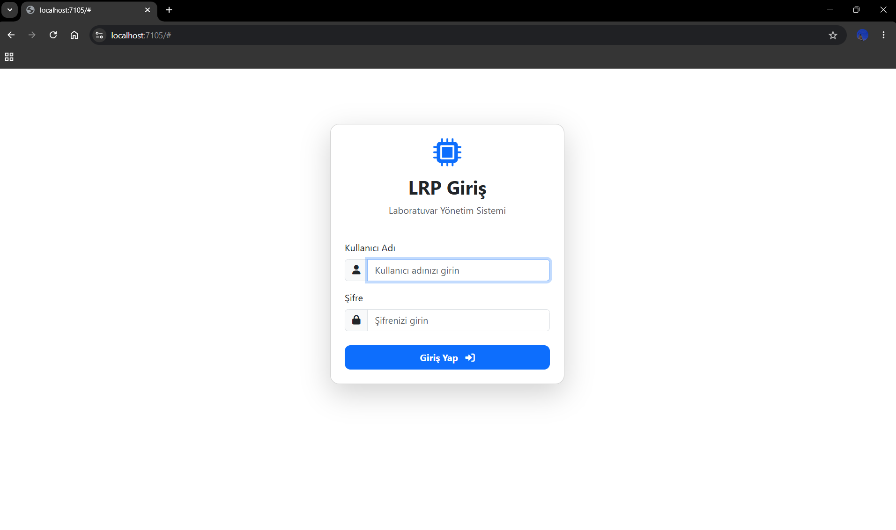
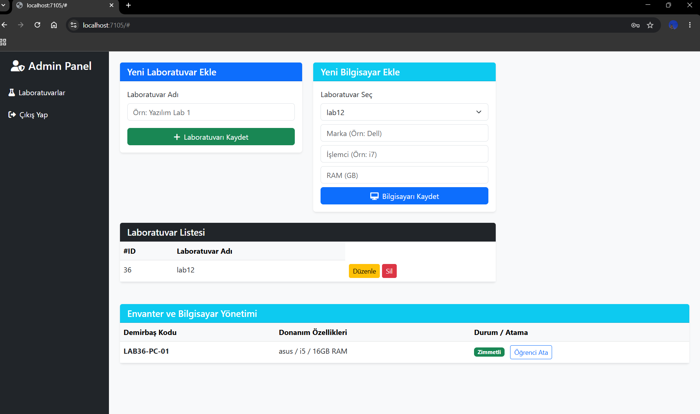
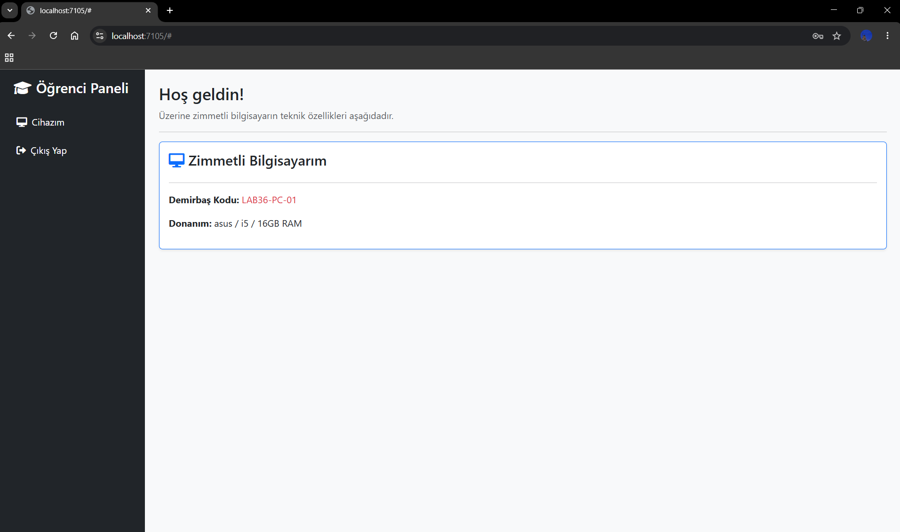

# LRP - Laboratuvar Kaynak Planlama Sistemi

Bu proje, laboratuvarlardaki bilgisayarlarýn ve bu bilgisayarlardan sorumlu öðrencilerin takip edilmesini saðlayan bir sistemdir.
.NET 8 Minimal APIs, SQLite ve Vanilla JavaScript kullanýlarak geliþtirilmiþtir.

## Projeyi Çalýþtýrma
Projeyi çalýþtýrmak için terminale `dotnet run` yazmanýz yeterlidir.

**Test Hesaplarý:**
* **Admin:** admin / admin123
* **Öðrenci:** (Oluþturduðunuz öðrenci numarasý) / 123

## Ekran Görüntüleri

### 1. Giriþ Ekraný

### 2. Admin Paneli (Laboratuvar ve Envanter Yönetimi)

### 3. Öðrenci Portalý (Zimmetli Cihaz)
